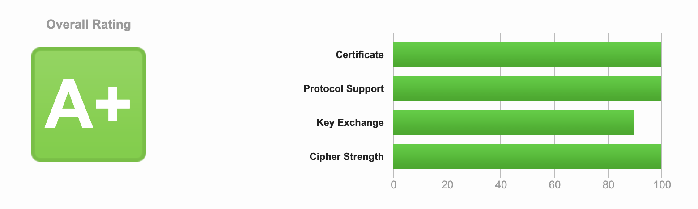

# docker-nginx-certbot <!-- omit in toc -->


Create and automatically renew website SSL certificates using the free [Let's Encrypt](https://letsencrypt.org/) certificate authority, and its client [_certbot_](https://certbot.eff.org/), built on top of the [Nginx](https://www.nginx.com/) webserver.

## :round_pushpin: &nbsp; Features <!-- omit in toc -->

|                                                      |                      |
| ---------------------------------------------------- | -------------------- |
| Distributed as Docker image                          | :white_check_mark:   |
| Built with Node                                      | :white_check_mark:   |
| Type safe code with TypeScript                       | :white_check_mark:   |
| Multi-platform support                               | :white_check_mark:   |
| Node signal handling to prevent zombies              | :white_check_mark:   |
| Configure multiple domains                           | :white_check_mark:   |
| Automatic Let's Encrypt certificate renewal          | :white_check_mark:   |
| Persistent volumes for certificates and Nginx logs   | :white_check_mark:   |
| Monorepo tooling by [Nx](nx.dev)                     | :white_check_mark:   |
| Unit tests                                           | :white_check_mark:   |
| Auto linting                                         | :white_check_mark:   |
| A+ overall rating at [SSL Labs](https://ssllabs.com) | :white_check_mark:   |
| Diffie-Hellman parameters                            | :white_check_mark:   |
| Group domains by a common domain owner               | :white_large_square: |
| Email renewal events to domain owner                 | :white_large_square: |
| Compodoc technical docs                              | :white_large_square: |

### SSL Labs rating

This rating is returned for both domains and sub domains.



## Table of contents <!-- omit in toc -->

- [:desktop_computer: &nbsp; Supported platforms](#desktop_computer--supported-platforms)
- [:dart: &nbsp; Usage](#dart--usage)
- [:policeman: &nbsp; Domain security](#policeman--domain-security)
- [:man_shrugging: &nbsp; How does this work?](#man_shrugging--how-does-this-work)
- [:gear: &nbsp; Managing certificates](#gear--managing-certificates)
- [:whale: &nbsp; Useful Docker commands](#whale--useful-docker-commands)
- [:bookmark: &nbsp; Reference sites](#bookmark--reference-sites)
- [:pray: &nbsp; Acknowledgments](#pray--acknowledgments)

## :desktop_computer: &nbsp; Supported platforms

Deployed Docker images can be found [here](https://github.com/orgs/abstract-tlabs/packages/container/package/docker-nginx-certbot%2Fnginx-certbot), supporting the following platforms:

| Platform     | Architecture   | Computers                                |
| ------------ | -------------- | ---------------------------------------- |
| linux/amd64  | AMD 64-bit x86 | Most today and the default Docker choice |
| linux/arm64  | ARM 64-bit     | Raspberry Pi 3 _(and later)_             |
| linux/arm/v7 | ARM 64-bit     | Raspberry Pi 2 Model B                   |

## :dart: &nbsp; Usage

### Prerequisites

The computer using this image must be reached from public for the certificates to be verified and created.

Make sure that your domain name is entered correctly and the DNS A/AAAA record(s) for that domain contain(s) the right IP address. Additionally, check that your computer has a publicly routable IP address and that no firewalls are preventing the server from communicating with the client.

### Environment Variables

#### Required

- `CERTBOT_EMAIL`  
  Usually the domain owner's email, used by Let's Encrypt as contact email in case of any security issues.

#### Optional

- `NODE_ENV`  
  For the official image this value is set to `production`, which means all renewal request are sent to Let's Encrypt `production` site. So, any other value e.g. `staging` or `abc` will use the `staging` site.

- `DRY_RUN`  
  This value is set to `N` by default, which will create real certificates. When this is set to `Y` renewal requests are sent but no changes to the certificate files are made. Use this to test domain setup and prevent any mistakes from creating bad certificates.

- `ISOLATED`  
  This value is set to `N` by default. When this is set to `Y` the certbot request is never made and status is faked successful. Isolated mode is only valuable during development or test, when your computer isn't setup to receive responses on port 80 and 443. With this option it's still possible to spin up the containter and let the renewal process loop do its thing.  
   [Read about how to run isolated tests.](###run-isolated-tests)

### Persistent Volumes

- `/etc/letsencrypt`: Generated domain certificates stored in domain specific folders.

  _Stored as Docker volume: `letsencrypt`_

- `/etc/nginx/ssl`: Common certificates for all domains, e.g. Diffie-Hellman parameters file.

  _Stored as Docker volume: `ssl`_

- `/var/log/nginx`: Nginx access and error logs.

  _Stored as Docker volume: `nginx`_

### Domain Configurations

Every domain to request certificates for must be stored in folder `conf.d`. The file should be named e.g. `domain.com.conf` and contain data at minimum:

```nginx
server {
  listen              443 ssl default_server;
  server_name         domain.com;

  ssl_certificate     /etc/letsencrypt/live/domain.com/fullchain.pem;
  ssl_certificate_key /etc/letsencrypt/live/domain.com/privkey.pem;

  include             /etc/nginx/secure.d/header.conf;
  include             /etc/nginx/secure.d/ssl.conf;

  location / {
    ...
  }
}
```

> :wave: &nbsp; **INFO**
>
> It's very important that the domain name (e.g. `my-site.io`) match for:
>
> - File name `my-site.io.conf`
> - Configuration property `server_name` to be `my-site.io`
> - Configuration properties
>   - `ssl_certificate` to be `/etc/letsencrypt/live/my-site.io/fullchain.pem`
>   - `ssl_certificate_key` to be `/etc/letsencrypt/live/my-site.io/privkey.pem`

&nbsp;

> :fire: &nbsp; **WARNING**
>
> Using a `server` block that listens on port 80 may cause issues with renewal. This container will already handle forwarding to port 443, so they are unnecessary. See `nginx_conf.d/http.conf`.

### Build and run yourself

If you have pulled the repository and are experimenting or just whats to build it yourself, the image could be built like this:

```sh
docker build -t nginx-certbot:local .
```

The command must be executed inside `project/` folder.

Prior to running the image the domains of interest must be created inside `conf.d/` folder. Then the container is launched like this:

```sh
docker run -it --rm -d \
           -p 80:80 -p 443:443 \
           --env CERTBOT_EMAIL=owner@domain.com \
           -v "$(pwd)/conf.d:/etc/nginx/user.conf.d:ro" \
           -v "$(pwd)/letsencrypt:/etc/letsencrypt" \
           -v "$(pwd)/nginx:/var/log/nginx" \
           -v "$(pwd)/ssl:/etc/nginx/ssl" \
           --name nginx-certbot \
           nginx-certbot:local
```

> :bulb: &nbsp; **NOTE**
>
> Here we use local folders for volumes `letsencrypt` and `nginx`, to benefit transparency during testing. For a production like setup this is not recommended.

### Run with `docker-compose`

There's an official Docker image deployed to GitLab Container Registry that can be used out of the box. The easiest way is to create a `docker-compose.yml` file like this:

```yml
version: '3.8'

services:
  nginx:
    image: ghcr.io/abstract-tlabs/docker-nginx-certbot/nginx-certbot:latest
    restart: unless-stopped
    environment:
      CERTBOT_EMAIL: owner@domain.com
    ports:
      - '80:80'
      - '443:443'
    volumes:
      - ./conf.d:/etc/nginx/user.conf.d:ro
      - letsencrypt:/etc/letsencrypt
      - nginx:/var/log/nginx
      - ssl:/etc/nginx/ssl

volumes:
  letsencrypt:
  nginx:
  ssl:
```

Then pull the image, build and start the container:

```sh
docker-compose build --pull
docker-compose -d up
```

### Run isolated tests

Isolated test are used when the computer can not receive reponses from Let's Encrypt. Mostly this is your local development computer.

During these tests no requests are sent to Let's Encrypt but the process is otherwise the real one. By running isolated tests the developer can see the output of the latest changes and get a quick sanity check as a complement to unit tests.

The only problem is the certificates provided by Let's Encrypt and this connection is, stated above, disconnected. Luckily there's a script creating self signed certificate files.

```sh
./isolated-test/make-certs.sh
```

```sh
docker-compose up
```

A fake domain `localhost.dev` is prepared in folder `isolated-test` but there's nothing stopping from creating more fake domains. Just create certificates from those domains as well, e.g. `my-site.com`.

```sh
./isolated-test/make-certs.sh my-site.com
```

## :policeman: &nbsp; Domain security

_To be written_

### Image provided configuration

Explain content of

- `/etc/nginx/secure.d/header.conf`
- `/etc/nginx/secure.d/ssl.conf`

### Diffie-Hellman parameters

...

## :man_shrugging: &nbsp; How does this work?

_To be written..._

## :gear: &nbsp; Managing certificates

Certificates can also be accessed from the running container by manually executing the `certbot` command.

More commands can be found in [References](#bookmark--reference-sites).

### List certificates known by `certbot`

List all certificates

```sh
docker exec nginx-certbot certbot certificates
```

or just domain.com

```sh
docker exec nginx-certbot certbot certificates --cert-name domain.com
```

### Revoke a certificate

```sh
docker exec nginx-certbot certbot revoke --cert-path /etc/letsencrypt/live/domain.com/fullchain.pem
```

Then delete all certificate files.

```sh
docker exec nginx-certbot certbot delete --cert-name domain.com
```

## :whale: &nbsp; Useful Docker commands

### Running containers

```sh
docker ps
```

### Container logs

`nginx-certbot` can be found using the previous command.

```sh
# Follow log output run-time
docker logs -f nginx-certbot

# Display last 50 rows
docker logs -n 50 nginx-certbot
```

These logs are also saved by `winston` as JSON objects to `/logs` folder.

```sh
# Error logs
docker exec nginx-certbot tail -200f /logs/error.log

# All other log level
docker exec nginx-certbot tail -200f /logs/combined.log
```

### List all `Let's Encrypt` domain folders

```sh
docker exec nginx-certbot ls -la /etc/letsencrypt/live
```

### List secret files for domain `domain.com`

```sh
docker exec nginx-certbot ls -la /etc/letsencrypt/live/domain.com
```

### Display `Nginx` main configuration

```sh
docker exec nginx-certbot cat /etc/nginx/nginx.conf
```

### List read-only `Nginx` configuration files provided by `nginx-certbot` image

```sh
# http/https configuration
docker exec nginx-certbot ls -la /etc/nginx/conf.d

# Secure server
docker exec nginx-certbot ls -la /etc/nginx/secure.d
```

### Follow `Nginx` logs

```sh
# Access logs
docker exec nginx-certbot tail -200f /var/log/nginx/access.log

# Error logs
docker exec nginx-certbot tail -200f /var/log/nginx/error.log
```

## :bookmark: &nbsp; Reference sites

- [Let's Encrypt](https://letsencrypt.org/)
- [Certbot](https://certbot.eff.org/)
- [Managing certificates](https://certbot.eff.org/docs/using.html?highlight=hook#managing-certificates)
- [GitHub Actions using Docker buildx](https://github.com/marketplace/actions/build-and-push-docker-images#usage)

## :pray: &nbsp; Acknowledgments

This repository was originally cloned from `@staticfloat`, kudos to him and all other contributors. The reason to make a clone is to convert from `bash` to `TypeScript` and privde unit tests. Still many good ideas are kept but in a different form.
