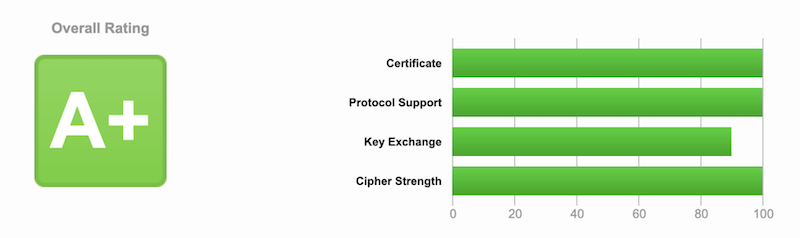
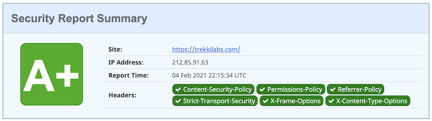

# docker-nginx-certbot <!-- omit in toc -->


Create and automatically renew website SSL certificates using the free [Let's Encrypt](https://letsencrypt.org/) certificate authority, and its client [Certbot](https://certbot.eff.org/), built on top of the [Nginx](https://www.nginx.com/) webserver.

## :round_pushpin: &nbsp; Features <!-- omit in toc -->

| Feature                                                                       |                    |
| ----------------------------------------------------------------------------- | ------------------ |
| Distributed as Docker image                                                   | :white_check_mark: |
| Built with Node                                                               | :white_check_mark: |
| Type safe code with TypeScript                                                | :white_check_mark: |
| [Multi-platform support](#desktop_computer--supported-platforms)              | :white_check_mark: |
| [Node signal handling](#man_shrugging--how-does-this-work) to prevent zombies | :white_check_mark: |
| Configure [multiple domains](#multiple-domains)                               | :white_check_mark: |
| Automatic Let's Encrypt certificate renewal                                   | :white_check_mark: |
| [Persistent volumes](#persistent-volumes) for certificates and logs           | :white_check_mark: |
| Monorepo tooling by [Nx](nx.dev)                                              | :white_check_mark: |
| Unit tests                                                                    | :white_check_mark: |
| Auto linting                                                                  | :white_check_mark: |
| [Diffie-Hellman parameters](#diffie-hellman-parameters)                       | :white_check_mark: |
| **A+** rating on [SSL Labs](https://ssllabs.com)                              | :white_check_mark: |
| **A+** rating on [Security Headers](https://securityheaders.com)              | :white_check_mark: |

### SSL Labs rating

This rating is returned for both domains and sub domains.



### Security Headers rating



## Table of contents <!-- omit in toc -->

- [:desktop_computer: &nbsp; Supported platforms](#desktop_computer--supported-platforms)
- [:dart: &nbsp; Usage](#dart--usage)
- [:policeman: &nbsp; Domain security](#policeman--domain-security)
- [:man_shrugging: &nbsp; How does this work?](#man_shrugging--how-does-this-work)
- [:gear: &nbsp; Managing certificates](#gear--managing-certificates)
- [:whale: &nbsp; Useful Docker commands](#whale--useful-docker-commands)
- [:bookmark: &nbsp; Reference sites](#bookmark--reference-sites)
- [:pray: &nbsp; Acknowledgments](#pray--acknowledgments)

## :desktop_computer: &nbsp; Supported platforms

Deployed releases can be found on Docker Hub [https://hub.docker.com/r/trekkilabs/nginx-certbot](https://hub.docker.com/r/trekkilabs/nginx-certbot).

| Platform     | Architecture   | Computers                                |
| ------------ | -------------- | ---------------------------------------- |
| linux/amd64  | AMD 64-bit x86 | Most today and the default Docker choice |
| linux/arm64  | ARM 64-bit     | Raspberry Pi 3 _(and later)_             |
| linux/arm/v7 | ARM 64-bit     | Raspberry Pi 2 Model B                   |

## :dart: &nbsp; Usage

### Prerequisites

The computer using this image must be reached from public for the certificates to be verified and created.

Make sure that your domain name is entered correctly and the DNS A/AAAA record(s) for that domain contain(s) the right IP address. Additionally, check that your computer has a publicly routable IP address and that no firewalls are preventing the server from communicating with the client.

### Environment Variables

#### Required

- `CERTBOT_EMAIL`  
  Usually the domain owner's email, used by Let's Encrypt as contact email in case of any security issues.

#### Optional

- `NODE_ENV`  
  For the official image this value is set to `production`, which means all renewal request are sent to Let's Encrypt `production` site. So, any other value e.g. `staging` or `abc` will use the `staging` site.

- `DRY_RUN`  
  This value is set to `N` by default, which will create real certificates. When this is set to `Y` renewal requests are sent but no changes to the certificate files are made. Use this to test domain setup and prevent any mistakes from creating bad certificates.

- `ISOLATED`  
  This value is set to `N` by default. When this is set to `Y` the certbot request is never made and status is faked successful. Isolated mode is only valuable during development or test, when your computer isn't setup to receive responses on port 80 and 443. With this option it's still possible to spin up the containter and let the renewal process loop do its thing. [Read about how to run isolated tests.](###run-isolated-tests)

### Persistent Volumes

- `/etc/letsencrypt`  
  Generated domain certificates stored in domain specific folders.

  _Stored as Docker volume: `letsencrypt_cert`_

- `/etc/nginx/ssl`  
  Common certificates for all domains, e.g. Diffie-Hellman parameters file.

  _Stored as Docker volume: `ssl`_

- `/var/log/letsencrypt`  
  Let's Encrypt logs.

  _Stored as Docker volume: `letsencrypt_logs`_

- `/var/log/nginx`  
  Nginx access and error logs.

  _Stored as Docker volume: `nginx_logs`_

### Domain Configurations

Every domain to request certificates for must be stored in folder `conf.d`. The file should be named e.g. `domain.com.conf` and contain data at minimum:

```nginx
server {
  listen              443 ssl default_server;
  server_name         domain.com www.domain.com;

  ssl_certificate     /etc/letsencrypt/live/domain.com/fullchain.pem;
  ssl_certificate_key /etc/letsencrypt/live/domain.com/privkey.pem;

  include             /etc/nginx/secure.d/header.conf;
  include             /etc/nginx/secure.d/ssl.conf;

  location / {
    ...
  }
}
```

> :wave: &nbsp; **INFO**
>
> It's very important that the domain name (e.g. `my-site.io`) match for:
>
> - File name `my-site.io.conf`
>
> - Configuration property `server_name` to be `my-site.io`
> - Configuration properties
>   - `ssl_certificate` to be `/etc/letsencrypt/live/my-site.io/fullchain.pem`
>   - `ssl_certificate_key` to be `/etc/letsencrypt/live/my-site.io/privkey.pem`

#### Multiple domains

It's possible to store several domains in one certificate. To do this the property `server_name` should contain all certificate domains. Important! All domains must be the same host and the host must be the first domain.

```nginx
server {
  ...
  server_name  domain.com www.domain.com sub.domain.com;
  ...
}
```

> :fire: &nbsp; **WARNING**
>
> Using a `server` block that listens on port 80 may cause issues with renewal. This container will already handle forwarding to port 443, so they are unnecessary. See `nginx_conf.d/http.conf`.

### Build and run yourself

If you have pulled the repository and are experimenting or just whats to build it yourself, the image could be built like this:

```sh
docker build -t nginx-certbot:local .
```

The command must be executed inside `project/` folder.

Prior to running the image the domains of interest must be created inside `conf.d/` folder. Then the container is launched like this:

```sh
docker run -it --rm -d \
           -p 80:80 -p 443:443 \
           --env CERTBOT_EMAIL=owner@domain.com \
           -v "$(pwd)/conf.d:/etc/nginx/user.conf.d:ro" \
           -v "$(pwd)/letsencrypt:/etc/letsencrypt" \
           -v "$(pwd)/nginx:/var/log/nginx" \
           -v "$(pwd)/ssl:/etc/nginx/ssl" \
           --name nginx-certbot \
           nginx-certbot:local
```

> :bulb: &nbsp; **NOTE**
>
> Here we use local folders for volumes `letsencrypt` and `nginx`, to benefit transparency during testing. For a production like setup this is not recommended.

### Run with `docker-compose`

There's an official Docker image deployed to GitLab Container Registry that can be used out of the box. The easiest way is to create a `docker-compose.yml` file like this:

```yml
version: '3.8'

services:
  nginx:
    image: trekkilabs/nginx-certbot:latest
    restart: unless-stopped
    environment:
      CERTBOT_EMAIL: owner@domain.com
    ports:
      - '80:80'
      - '443:443'
    volumes:
      - ./conf.d:/etc/nginx/user.conf.d:ro
      - letsencrypt_cert:/etc/letsencrypt
      - letsencrypt_logs:/var/log/letsencrypt
      - nginx_logs:/var/log/nginx
      - ssl:/etc/nginx/ssl

volumes:
  letsencrypt_cert:
  letsencrypt_logs:
  nginx_logs:
  ssl:
```

Then pull the image, build and start the container:

```sh
docker-compose build --pull
docker-compose -d up
```

### Run isolated tests

Isolated test are used when the computer can not receive reponses from Let's Encrypt. Mostly this is your local development computer.

During these tests no requests are sent to Let's Encrypt but the process is otherwise the real one. By running isolated tests the developer can see the output of the latest changes and get a quick sanity check as a complement to unit tests.

The only problem is the certificates provided by Let's Encrypt and this connection is, described above, disconnected. Luckily there's a script creating self signed certificate files.

```sh
./isolated-test/make-certs.sh
```

```sh
docker-compose up
```

A fake domain `localhost` is prepared in folder `isolated-test` but there's nothing stopping from creating more fake domains. Just create certificates from those domains as well, e.g. `my-site.com`.

```sh
./isolated-test/make-certs.sh my-site.com
```

### Run test with expected failure

This test is a variant of isolated test with the same configuration. The only difference is that the renewal request is actually sent to Let's Encrypt but with `--dry-run` flag applied. However we know that `localhost` isn't a fully qualified domain and hence the request will fail.

It's an educational example how `stderr` from a spawned `certbot` command may look like.

```sh
docker-compose -f docker-compose.dry-run.yml up
```

## :policeman: &nbsp; Domain security

### Image provided configuration

Some configurations are provided by the image. Those files are located in the `nginx_conf.d/secure.d` folder.

- `header.conf`  
  This file contains header properties to fine tune the browser security and availability behaviour. Test the settings on [Security Headers](https://securityheaders.com/).

  More about headers on site [https://developer.mozilla.org/en-US/docs/Web/HTTP/Headers/](https://developer.mozilla.org/en-US/docs/Web/HTTP/Headers/), or use the links provided inside `header.conf` file.

  > :fire: It's highly likely that these properties needs to be changed depending on your, or the hosted sites needs.

- `location.conf`  
  This file is not used by default by the image but is available for [reverse proxy location blocks](http://nginx.org/en/docs/http/ngx_http_upstream_module.html).
  There's an example inside this file.

- `ssl.conf`  
  This file contains security properties including Diffie-Hellman parameters.

### Diffie-Hellman parameters

This adds another layer of security. It's best explained by [Wikipedia](https://en.wikipedia.org/wiki/Diffie%E2%80%93Hellman_key_exchange).

The default configuration promotes 2048 bits. Higher bit rates could be used but this will lead to reduced performance. It's your choice but 2048 bits is quite hard to crack.

## :man_shrugging: &nbsp; How does this work?

### Node service

Instead of starting a shell script, which is very common, this solution starts a Node service. The reason for this is to have more control over development, mostly regarding unit test, but also to benefit from TypeScript. [TypeScript](https://www.typescriptlang.org/) is a superset of JavaScript and provides type-safe code.

The service is starter within the image, declared in `Dockerfile`.

```dockerfile
...
ENTRYPOINT ["node", "/app/dist/apps/init/main.js"]
...
```

The `init` application is the main container thread and will always get PID 1. All other processes spawned by `init` will be child processes of `init`. It's therefore important for `init` to setup listeners for `SIG`-signals to prevent the child processes to become zoombies in case `init` gets terminated.

The flow chart for `init` application:

1. Setup listeners to `SIGINT`, `SIGTERM` and `SIGUSR2`.

2. Look for Diffie-Hellman parameters file. Create the file if wasn't found.  
   Exit `init` if `/etc/nginx/ssl/dhparam.pem` could not be created.
3. Transfer user domain configurations to `Nginx` configuration folder.  
   `(local machine repo):conf.d/*.conf` :arrow_right: `(container):/etc/nginx/conf.d/`
4. Analyze all domain configuration files and make sure all certificate `.pem` files exists. When one is missing the file is renamed with a `.pending` suffix. If we don't do this and start `Nginx` the domain is started in a insecure state.
5. Test `Nginx` configuration and exit if failed.
6. Start `Nginx` service by spawning a new child process. Setup listeners to `close`, `stdout`, `stderr`, `disconnect` and `error` events. All events output log data but only the `close` event will sent a exit signal to the parent process.
7. Start the main loop by creating a interval timer. Default value of timer is 24 hours.

   1. Begin the renewal process for all valid domains.

   2. Exit if environment `CERTBOT_EMAIL` is undefined.
   3. Get all [valid domains](#valid-domain-checks) from configuration files.
   4. For each domain send renewal request to Let's Encrypt and let they determine if the certificate needs to be renewed. Otherwise all `.pem` files are left unchanged.
   5. If the request fails all processes will be terminated. But when successful and the domain was marked by a `.pending` suffix, it will be renamed back to the origin name.
   6. Reload `Nginx` configuration after all the domains have been processed. This is to ensure that the pending domains gets activated.

8. Wait for the timer to elapse and another renewal process will start.

### `Nginx` configuration

Inside folder `nginx_conf.d` there are some configuration files for `Nginx` that works out of the box. It's not intended for those to be edited but, of course, if you know what you're doing feel free to improve or adjust to your needs.

- Local folder: `nginx_conf.d/...`

- Container folder: `/etc/nginx/...`

| Config file    | Local folder | Container folder | Responsibility                                               |
| -------------- | ------------ | ---------------- | ------------------------------------------------------------ |
| `certbot.conf` | `conf.d/`    | `conf.d/`        | Verifying ACME challenges from Let's Encrypty                |
| `gzip.conf`    | `conf.d/`    | `conf.d/`        | Comression (`gzip`) settings                                 |
| `http.conf`    | `conf.d/`    | `conf.d/`        | Port 80 listener; redirects to `certbot.conf` or 443 (https) |
| `header.conf`  | `secure.d/`  | `secure.d/`      | Header properties for improved security                      |
| `ssl.conf`     | `secure.d/`  | `secure.d/`      | SSL/TLS properties for strong encryption                     |

### User domain configuration

It's no purpose to run the image if no domains are specified. All the user domains should be located inside `conf.d/` folder. **Not** the one `nginx_conf.d/conf.d/` described obove, but a new folder that needs to be created. Example of a domain configuration is described in [domain configurations](#domain-configurations). A practical use case is also available in `isolated_test/` folder, which is described in [run isolated tests](#run-isolated-tests).

Create as many files as needed where each file will create a certificate. E.g. a certificate for `my-site.io` requires a file named `my-site.io.conf`.

#### Valid domain checks

For a domain to be marked as _valid_ and hence be included in the renewal process, a number of checks needs to pass:

1. The domain [extracted from configuration](#domain-configurations) file must be a valid host.  
   It's also possible to use `localhost`, but that is actually only useful when running isolated test.

2. Property `ssl_certificate_key` must exist inside configuration file and the path to the certificate file must [correspond to the domain name](#domain-configurations).
3. For property `server_name` inside the configuration file
   1. the primary domain (e.g. `my-site.io`) must be ordered first
   2. all domains must belong to the same host
   3. all domains must be unique

## :gear: &nbsp; Managing certificates

Certificates can also be accessed from the running container by manually executing the `certbot` command.

More commands can be found in [References](#bookmark--reference-sites).

### List certificates known by `certbot`

List all certificates

```sh
docker exec nginx-certbot certbot certificates
```

or just domain.com

```sh
docker exec nginx-certbot certbot certificates --cert-name domain.com
```

### Revoke a certificate

```sh
docker exec nginx-certbot certbot revoke --cert-path /etc/letsencrypt/live/domain.com/fullchain.pem
```

Then delete all certificate files.

```sh
docker exec nginx-certbot certbot delete --cert-name domain.com --non-interactive
```

### Force renewal of certificates

This feature uses `SIGUSR2` to notify the container to start a renewal process with `--force-renewal` flag applied.

```sh
docker kill --signal=USR2 nginx-certbot
```

But don't do this to often, otherwise the Let's Encrypt limit might be reached.

## :whale: &nbsp; Useful Docker commands

### Running containers

```sh
docker ps
```

### Container logs

`nginx-certbot` can be found using the previous command.

```sh
# Follow log output run-time
docker logs -f nginx-certbot

# Display last 50 rows
docker logs -n 50 nginx-certbot
```

These logs are also saved by `winston` as JSON objects to `/logs` folder.

```sh
# Error logs
docker exec nginx-certbot tail -200f /logs/error.log

# All other log level
docker exec nginx-certbot tail -200f /logs/combined.log
```

### List all `Let's Encrypt` domain folders

```sh
docker exec nginx-certbot ls -la /etc/letsencrypt/live
```

### List secret files for domain `domain.com`

```sh
docker exec nginx-certbot ls -la /etc/letsencrypt/live/domain.com
```

### Display `Nginx` main configuration

```sh
docker exec nginx-certbot cat /etc/nginx/nginx.conf
```

### List read-only `Nginx` configuration files provided by `nginx-certbot` image

```sh
# http/https configuration
docker exec nginx-certbot ls -la /etc/nginx/conf.d

# Secure server
docker exec nginx-certbot ls -la /etc/nginx/secure.d
```

### Follow `Nginx` logs

```sh
# Access logs
docker exec nginx-certbot tail -200f /var/log/nginx/access.log

# Error logs
docker exec nginx-certbot tail -200f /var/log/nginx/error.log
```

## :bookmark: &nbsp; Reference sites

- [Let's Encrypt](https://letsencrypt.org/)
- [Certbot](https://certbot.eff.org/)
- [Managing certificates](https://certbot.eff.org/docs/using.html?highlight=hook#managing-certificates)
- [GitHub Actions using Docker buildx](https://github.com/marketplace/actions/build-and-push-docker-images#usage)

## :pray: &nbsp; Acknowledgments

This repository was originally cloned from `@staticfloat`, kudos to him and all other contributors. The reason to make a clone is to convert from `bash` to `TypeScript` and privde unit tests. Still many good ideas are kept but in a different form.
